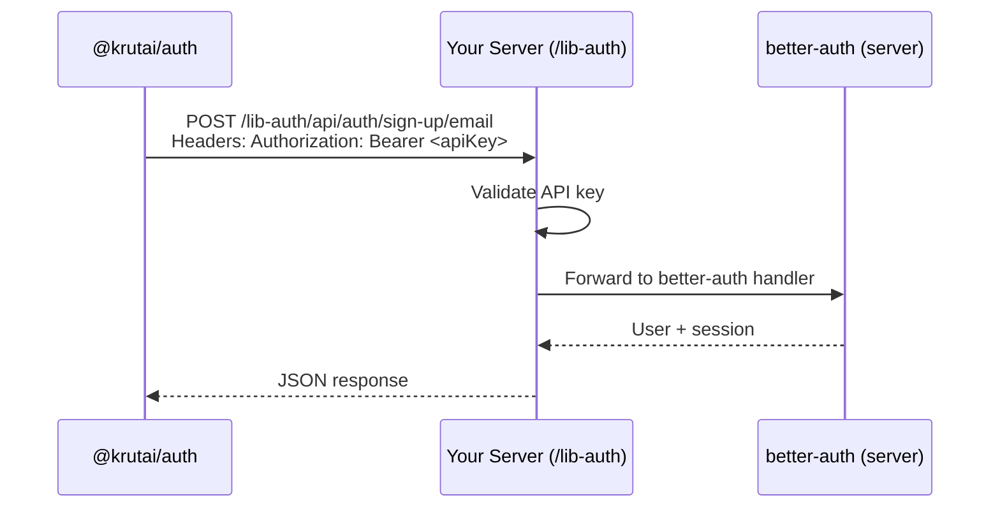

# @krutai/auth — AI Assistant Reference Guide

## Package Overview

- **Name**: `@krutai/auth`
- **Version**: `0.4.0`
- **Purpose**: Fetch-based authentication client for KrutAI — calls your server's `/lib-auth` routes (powered by better-auth on the server side)
- **Entry**: `src/index.ts` → `dist/index.{js,mjs,d.ts}`
- **Build**: `tsup` (CJS + ESM, `krutai` external)

## Dependency Architecture

```
@krutai/auth@0.4.0
└── dependency: krutai              ← API key validation (also peerDep)
```

> **Important for AI**: This package has NO `better-auth`, `better-sqlite3`, or database dependencies. All auth logic lives on the server. This package is a pure HTTP client.

## File Structure

```
packages/auth/
├── src/
│   ├── index.ts     # Exports krutAuth factory + KrutAuth class + types + validators
│   ├── client.ts    # KrutAuth class (fetch-based auth client)
│   └── types.ts     # KrutAuthConfig, auth params, auth response types
├── package.json
├── tsconfig.json
└── tsup.config.ts
```

## How It Works



## Main Exports

### `krutAuth(config)` ← FACTORY (recommended)

Creates a `KrutAuth` instance. Mirrors `krutAI()` from `@krutai/ai-provider`.

```typescript
import { krutAuth } from "@krutai/auth";

const auth = krutAuth({
  apiKey: process.env.KRUTAI_API_KEY!,
  serverUrl: "https://krut.ai",
});

await auth.initialize(); // validates key against server
```

### `KrutAuth` class ← CORE CLIENT

| Method | HTTP Call | Description |
|---|---|---|
| `initialize()` | validates API key | Must be called before other methods |
| `signUpEmail(params)` | `POST /lib-auth/api/auth/sign-up/email` | Register a new user |
| `signInEmail(params)` | `POST /lib-auth/api/auth/sign-in/email` | Authenticate a user |
| `getSession(token)` | `GET /lib-auth/api/auth/get-session` | Retrieve session info |
| `signOut(token)` | `POST /lib-auth/api/auth/sign-out` | Invalidate a session |
| `request(method, path, body?)` | Any | Generic helper for custom endpoints |
| `isInitialized()` | — | Check if client is ready |

### Types

#### `KrutAuthConfig`
```typescript
interface KrutAuthConfig {
  apiKey?: string;          // defaults to process.env.KRUTAI_API_KEY
  serverUrl?: string;       // default: "http://localhost:8000"
  authPrefix?: string;      // default: "/lib-auth"
  validateOnInit?: boolean; // default: true
}
```

#### `SignUpEmailParams` / `SignInEmailParams`
```typescript
interface SignUpEmailParams { email: string; password: string; name: string; }
interface SignInEmailParams { email: string; password: string; }
```

#### `AuthResponse`
```typescript
interface AuthResponse { token: string; user: AuthUser; }
```

#### `AuthSession`
```typescript
interface AuthSession { user: AuthUser; session: AuthSessionRecord; }
```

### Validator Re-exports (from `krutai`)

```typescript
export { validateApiKeyFormat, validateApiKey } from 'krutai';
```

## Usage Examples

### Example 1: Sign Up + Sign In
```typescript
import { krutAuth } from "@krutai/auth";

const auth = krutAuth({
  apiKey: process.env.KRUTAI_API_KEY!,
  serverUrl: "https://krut.ai",
});
await auth.initialize();

// Sign up
const { token, user } = await auth.signUpEmail({
  email: "user@example.com",
  password: "secret123",
  name: "Alice",
});
console.log("Signed up:", user.email);

// Sign in
const result = await auth.signInEmail({
  email: "user@example.com",
  password: "secret123",
});
console.log("Token:", result.token);
```

### Example 2: Session Management
```typescript
// Get session
const session = await auth.getSession(token);
console.log("User:", session.user.email);

// Sign out
await auth.signOut(token);
```

### Example 3: Custom Endpoint
```typescript
// Call any better-auth endpoint via the generic request method
const data = await auth.request("POST", "/api/auth/some-custom-endpoint", {
  someParam: "value",
});
```

### Example 4: Error Handling
```typescript
import { krutAuth, KrutAuthKeyValidationError } from "@krutai/auth";

try {
  const auth = krutAuth({ apiKey: "bad" });
  await auth.initialize();
} catch (e) {
  if (e instanceof KrutAuthKeyValidationError) {
    console.error("Invalid API key:", e.message);
  }
}
```

## Important Notes

1. **No local database**: All auth logic runs on your server — this package is a pure HTTP client
2. **API key in headers**: Every request sends `Authorization: Bearer <key>` and `x-api-key` headers
3. **Server prefix**: Auth routes are prefixed with `/lib-auth` by default (configurable via `authPrefix`)
4. **Call `initialize()` first**: Must validate API key before calling auth methods
5. **Same pattern as ai-provider**: Works identically to `KrutAIProvider` — construct, initialize, call methods

## Related Packages

- `krutai` — Core utilities and API validation (peer dep)
- `@krutai/ai-provider` — AI provider (same fetch-based pattern)

## Links

- GitHub: https://github.com/AccountantAIOrg/krut_packages
- npm: https://www.npmjs.com/package/@krutai/auth
